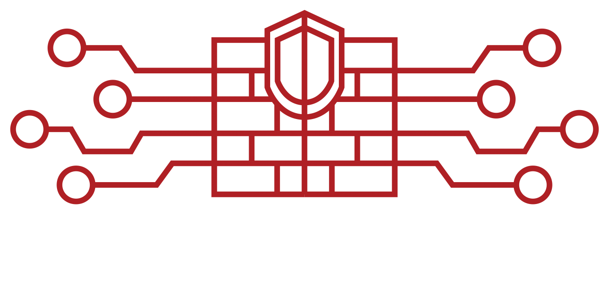

# </img> Buildtech Systems - Derek Hopkins

<h3>I don't just build tech... I Buildtechsys</h3>

  

</img>

## About Buildtech Systems

Buildtech Systems is my professional identity as a fullstack developer. This website showcases my services, portfolio, and expertise in web development. Designed with React and Tailwind CSS, built with Vite, and deployed on Vercel, this site serves as the digital home for my sole proprietorship.

## Features

- **Professional Portfolio**: Showcase of past projects, client work, and some features I'm testing out
- **Contact Information**: Easy ways for potential clients to reach out
- **About Me**: Professional and Academic background, expertise, and a sneak peek into my other passions
- **Responsive Design**: I try to develop for all screen sizes and resolutions, this site is a testament of that

## Tech Stack

- **Frontend**: React v19
- **Build Tool**: Vite 
- **Styling**: Tailwind CSS and Tailwind UI/Plus
- **Deployment**: Vercel for CI/CD as well as hosting
- **Backend**: Currently this site does not utilize any APIs or Database calls simply because there is no need for it... yet

## Business Information

Buildtech Systems is a registered DBA for Derek Hopkins, operating as a sole proprietorship in Texas, USA.

## Contact

- Email: dhopkins@buildtechsys.com
- LinkedIn: https://www.linkedin.com/in/dkh707/
- GitHub: https://github.com/DKH707

&copy; 2025 Buildtech Systems